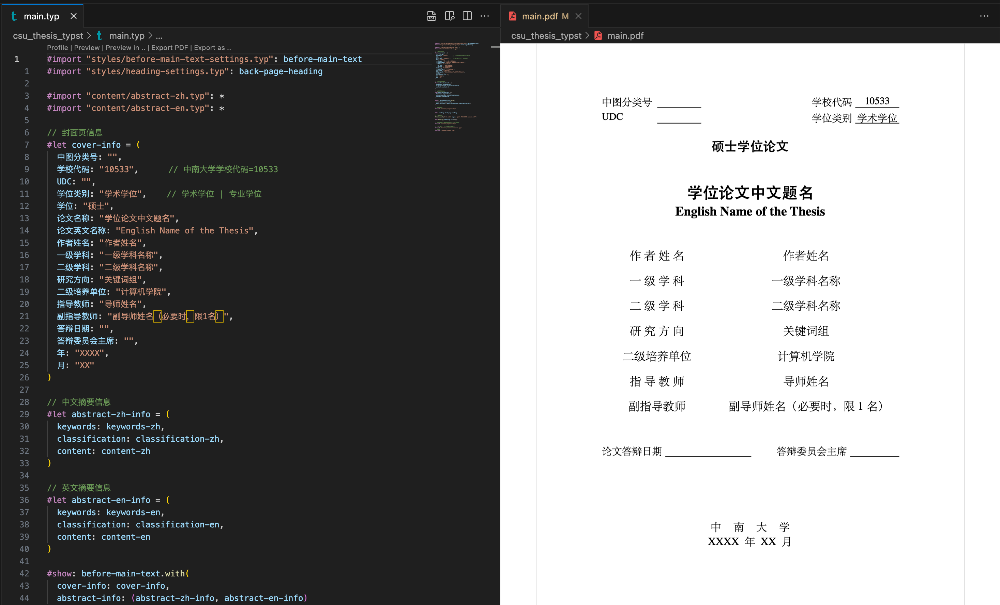

# 中南大学研究生学位论文 Typst 模板

中南大学硕士/博士研究生毕业设计论文的 Typst 模板。能够生成 pdf 格式的论文。



> 目前暂未测试 Windows 下的结果

## 教程

### 安装 Typst

- 命令行安装
    - MacOS: `brew install typst`
    - Windows: `winget install --id Typst.Typst`
- 手动安装
  - 来到 [typst releases](https://github.com/typst/typst/releases) 下，找到相应的版本并安装

### 使用模板

模板效果：见 `main.pdf`

- 用 `vs code` 打开项目，搜索扩展 `Tinymist Typst` 并安装
- 快捷键 `ctrl + ~` 打开 `vs code` 的命令行
- 执行 `typst watch main.typ --font-path=fonts`
- `vs code` 内分屏打开 `main.pdf` 实时查看输出结果

> 编译后会出现大量字体不存在的警告，这是为了兼容 Windows 和 MacOS 的字体设置了一些冗余的字体名称。

更多使用方法见模板内部的示例。

### 项目结构

```
csu_thesis_typst
├── README.md
├── gb-t-7714-2015-numeric.csl    // 参考文献样式
├── ref.bib                       // 参考文献
├── main.typ                      // 文件入口
├── content             
│   ├── assets                    // 存放图像或数据的位置
│   │   └── example.png
│   ├── abstract-en.typ           // 英文摘要
│   ├── abstract-zh.typ           // 中文摘要
│   ├── appendix.typ              // 附录
│   ├── chapters.typ              // 撰写论文正文
│   ├── notation-explain.typ      // 符号解释页
│   ├── research-results.typ      // 攻读学位期间主要的研究成果
│   └── thanks.typ                // 致谢
├── fonts                         // 字体文件
├── pages                          // 特定页面的样式
└── styles                         // 全局样式设置
```

### Typst 资料

- [Typst 中文教程](https://typst-doc-cn.github.io/tutorial/introduction.html)
- [面向 Latex 用户指南](https://typst-doc-cn.github.io/docs/guides/guide-for-latex-users/) | [Guide for LaTeX users](https://typst.app/docs/guides/guide-for-latex-users/)
- [Typst 中文社区导航](https://typst-doc-cn.github.io/guide/)
- [Typst Documentation](https://typst.app/docs/)
- [typst - github](https://github.com/typst/typst)